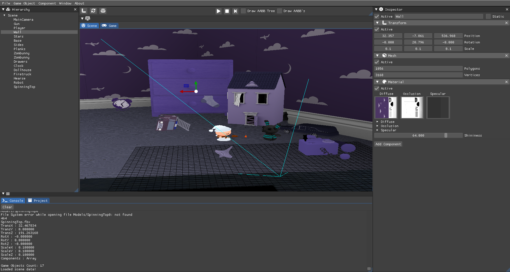

 # Salsa Engine

Salsa Engine is a C++ 3D Engine project developed for the Master's degree Advanced Programming for AAA Video Games.

## Installation

Download the last Release from [here](https://github.com/Kibium/SalsaEngine) and run the .exe file you will find inside the .zip.

## Controls

### Window Controls 
* Double-click on title bar to collapse window.
* Click and drag on lower corner to resize window\n(double-click to auto fit window to its contents).
* Click and drag on title bar to move window.
* Click in the icons in the above the scene to Rotate, Scale, and Transform.

### Camera Controls
To be available to move around the Scene, the window must be selected.
* Click anywhere in the Scene window to select it.
* Move the view around using the mouse.
* The WASD keys to move left/right/forward/backward, and the Q and E keys to move up and down.
* The Arrow keys to rotate left/right/forward/backward.
* Hold down Shift to move faster.
* Mouse Wheel to zoom Scene contents.
* Alt+Right Click Mouse to orbit around the object in the Scene.
* The RTY keys to Rotate, Transform and Scale the objects.

### What you can do
Drag and Drop files inside the Engine.

For Model objects, only the ASSIMP supported formats can be loaded.
For Textures, only the DevIL supported formats can be loaded.

Create, save and load scenes.
Create Game Objects with models.
Explore the scene you created.
See the Bounding boxes produced by your Game Objects.
See an AABB Tree created with the AABB from your GO, to accelerate maths processing.

## Built With

* [Visual Studio 2017](https://visualstudio.microsoft.com/es/vs/) - For coding purposes
* [GLEW](http://glew.sourceforge.net/) - OpenGL Management
* [SDL 2.0](https://www.libsdl.org/index.php) - Window and input Management
* [MathGeoLib](https://github.com/juj/MathGeoLib) - Math Management
* [Dear ImGUI](https://github.com/ocornut/imgui) - UI Creation and Management
* [DevIL](http://openil.sourceforge.net/) - Textures loader
* [ASSIMP](https://github.com/assimp/assimp) - Model Loader
* [IconFontCppHeaders](https://github.com/juliettef/IconFontCppHeaders) - Import to be able to use icons
* [FontAwesome](https://fontawesome.com/) - Icons font
* [Debug Draw](https://github.com/glampert/debug-draw/blob/master/debug_draw.hpp) - Debug drawer
* [AABB Tree](https://www.azurefromthetrenches.com/introductory-guide-to-aabb-tree-collision-detection/) - AABB Tree to accelerate frustums.
* [Rapid Json](https://github.com/Tencent/rapidjson/) - Save and Load the Scenes
* [ImGuizmo](https://github.com/CedricGuillemet/ImGuizmo) - Guizmo Drawer interface
* [PhysFS](http://icculus.org/physfs/) - File System

## Authors
[Jordi Sauras Salas](http://www.github.com/JorxSS).  [Joan Guinard Mateo](https://github.com/JoanStinson).  [Toni Ferrari Juan](https://github.com/Kibium).

## Contributing
For any idea of improve changes, please open an issue first to discuss the idea.

## License
[MIT](https://choosealicense.com/licenses/mit/)
